<h1 style="text-align: center;">CASOS DE USO</h1>

### Enlace Repositorio : https://github.com/tomasyoel/automatizacionloopify   


### Caso de Uso: Registro de Usuario 
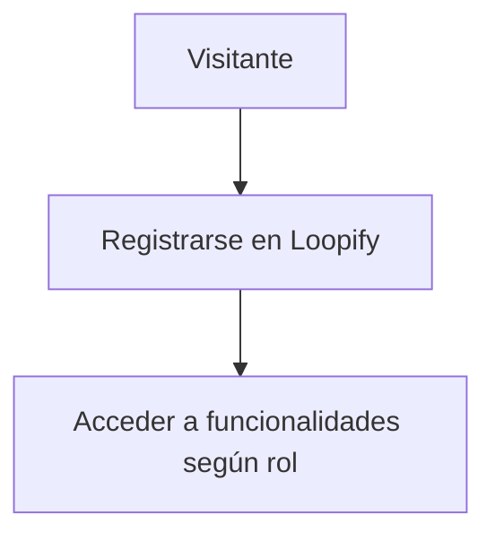

### Diagrama de Secuencia: Acceso al Formulario de Registro

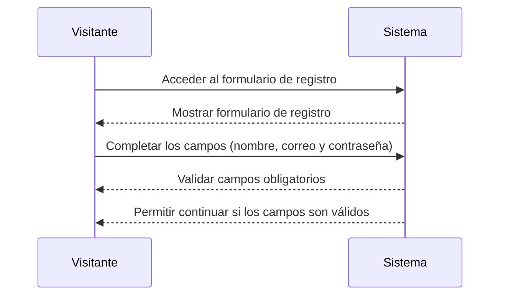

### Diagrama de Secuencia: Asignación de Rol de Cliente

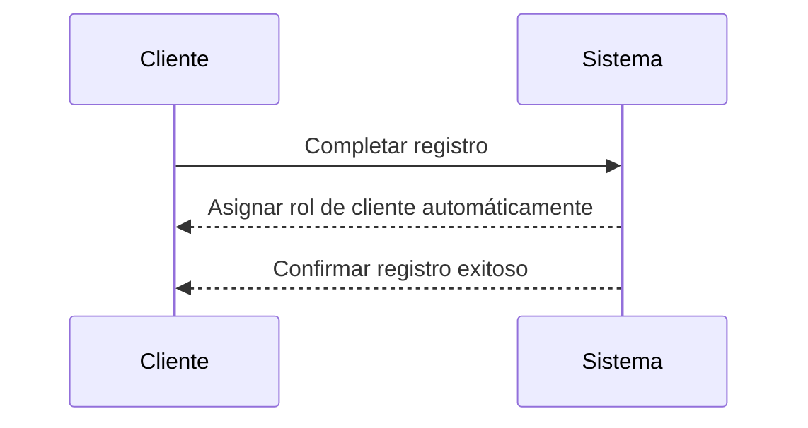

### Diagrama de Secuencia: Creación de Cuenta por Administrador

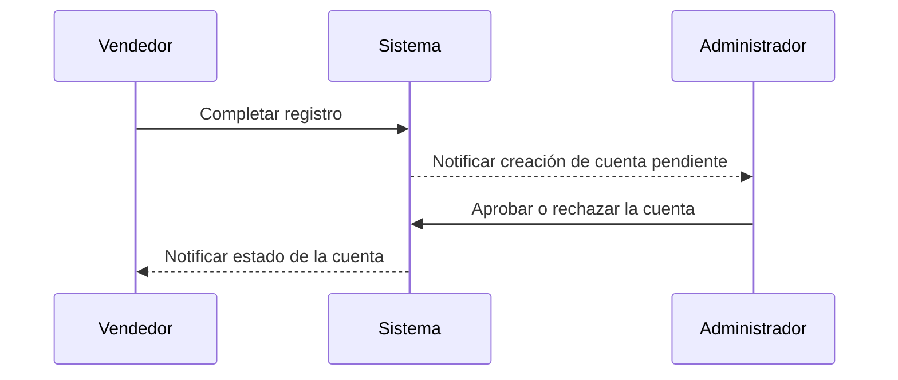

### Diagrama de Secuencia: Validación de Correo Único

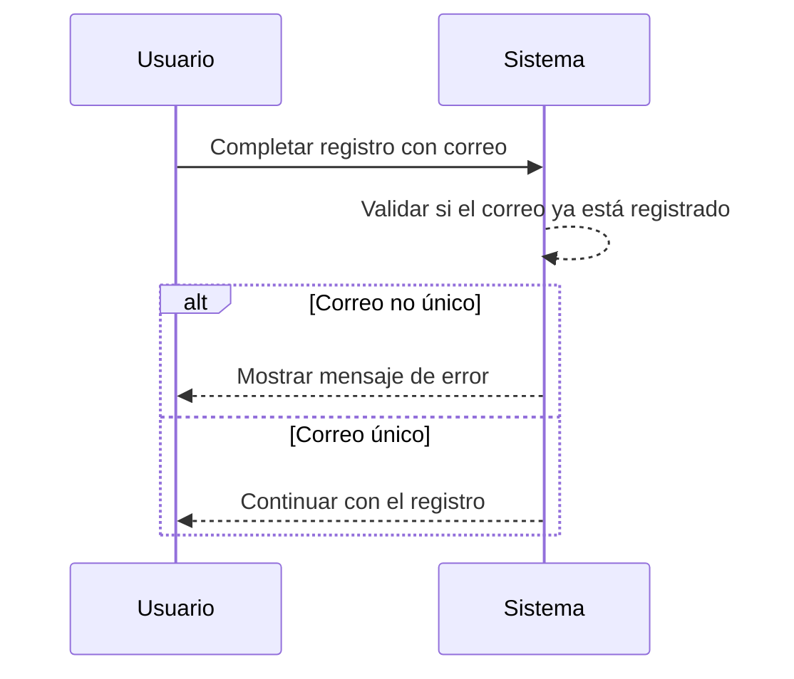

### Diagrama de Secuencia: Mensaje de Confirmación de Registro

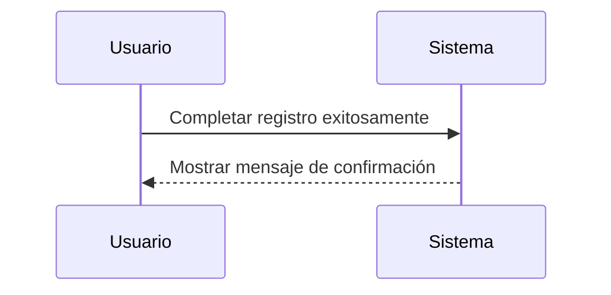

### Diagrama de Secuencia: Tiempo de Carga del Formulario

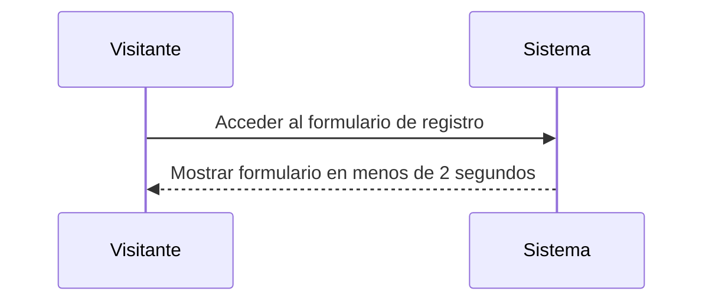

### Diagrama de Secuencia: Cifrado de Contraseña

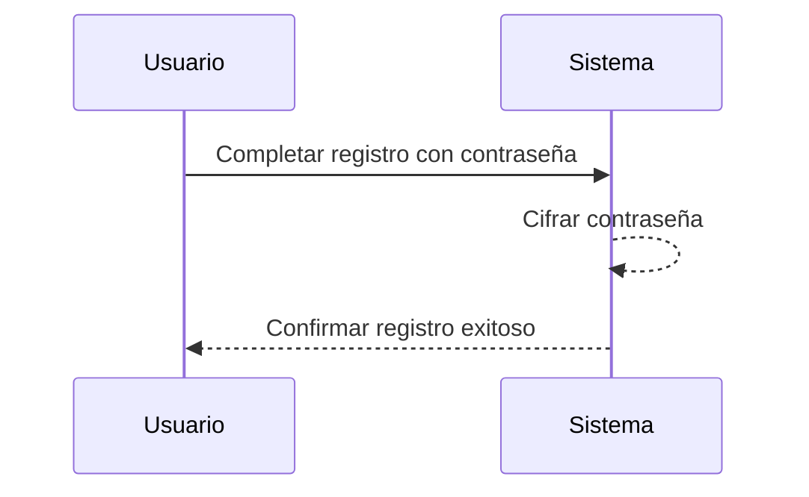


### Caso de Uso: Inicio de Sesion 

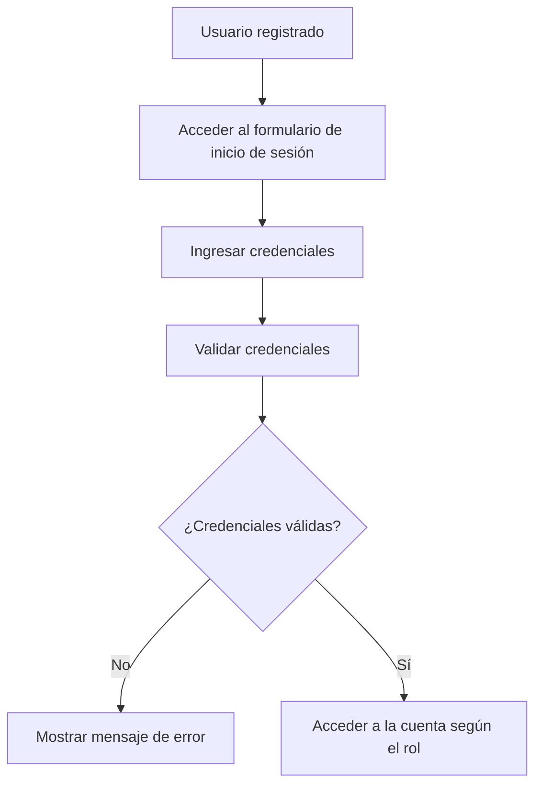

### Diagrama de Secuencia: Campos de Inicio de Sesión

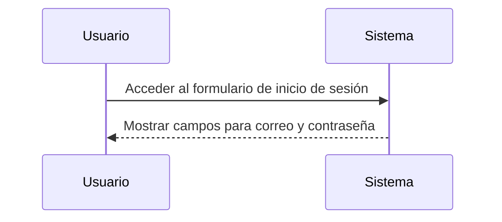

### Diagrama de Secuencia: Mensaje de Error por Credenciales Incorrectas

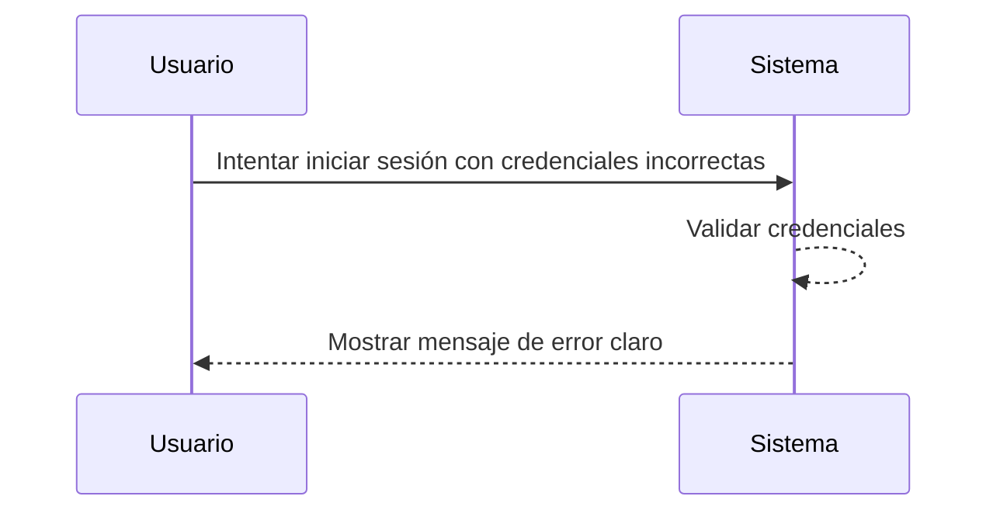

### Diagrama de Secuencia: Redirección según Rol

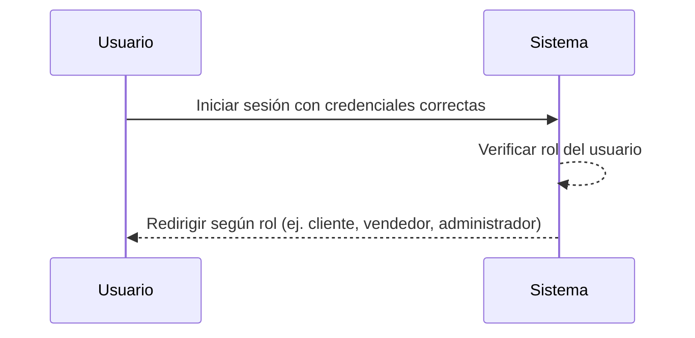

### Diagrama de Secuencia: Redirección para Administrador

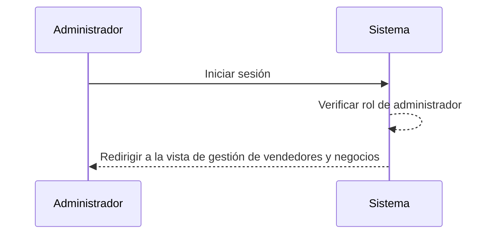

### Diagrama de Secuencia: Recuperación de Contraseña

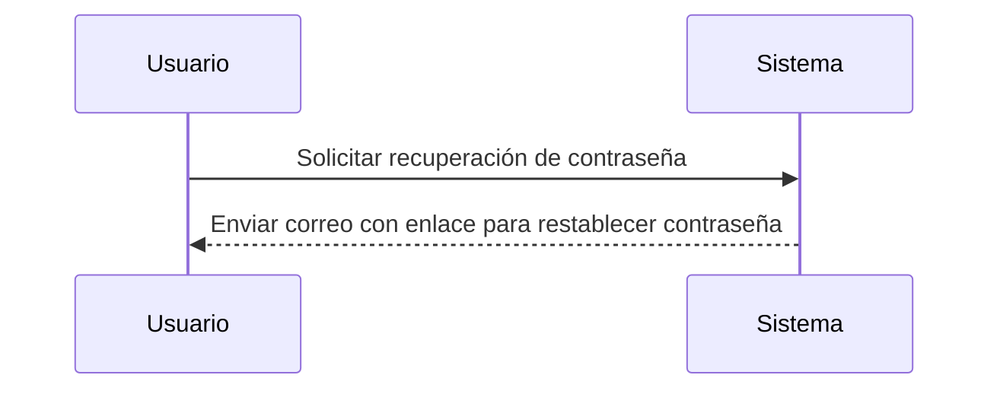

### Diagrama de Secuencia: Inicio de Sesión en Menos de 3 Segundos

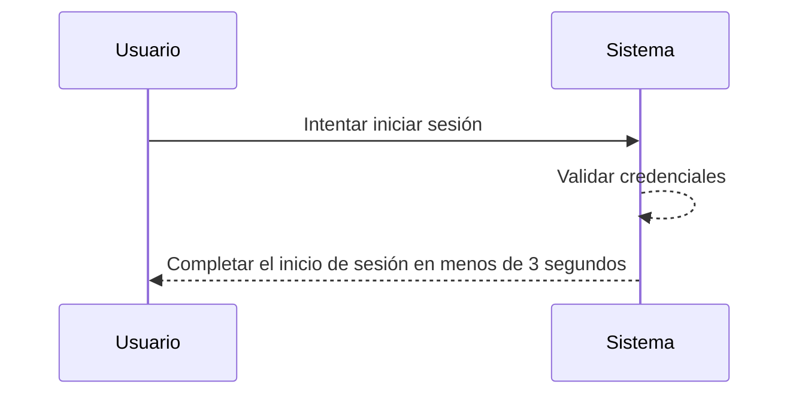

### Diagrama de Secuencia: Expiración de Sesión por Inactividad

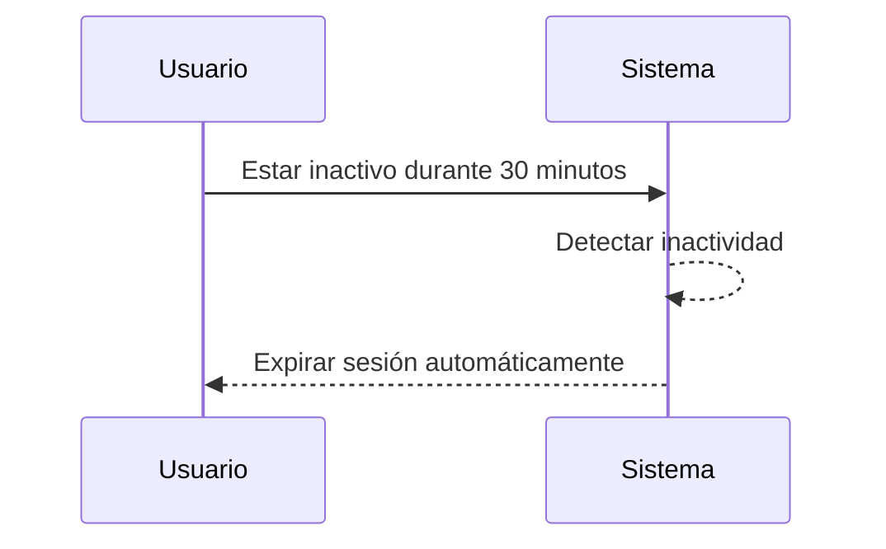

### Caso de Uso: Gestion de Vendedores 

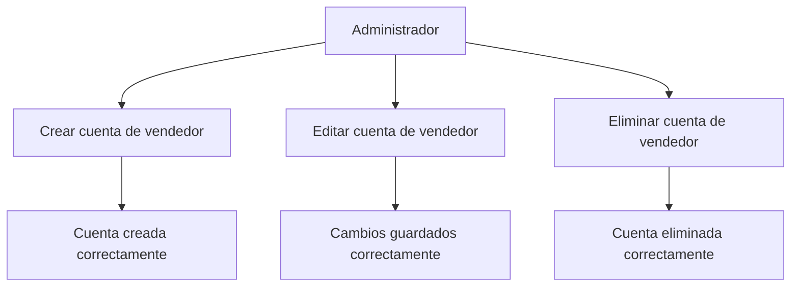

### Diagrama de secuencia: Opciones para editar y eliminar vendedores
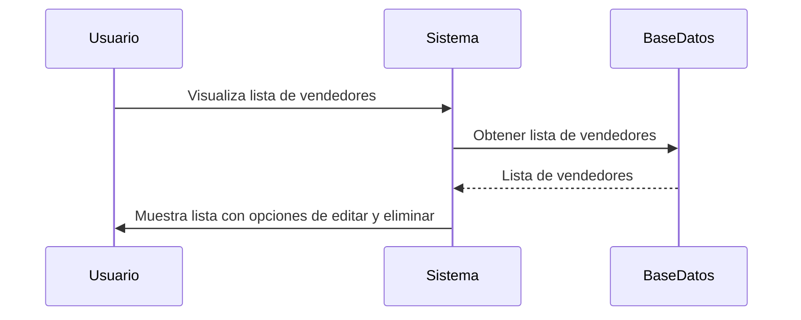

### Diagrama de secuencia: Eliminar un vendedor y sus negocios y productos
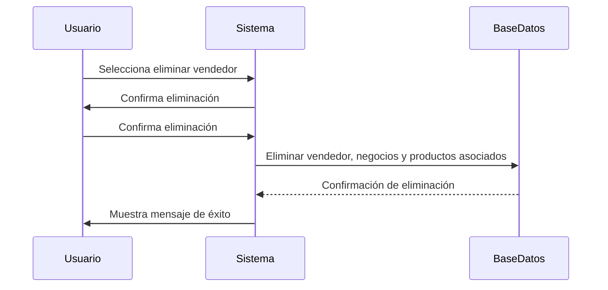

### Diagrama de secuencia: Asignar un negocio al vendedor al crear uno nuevo
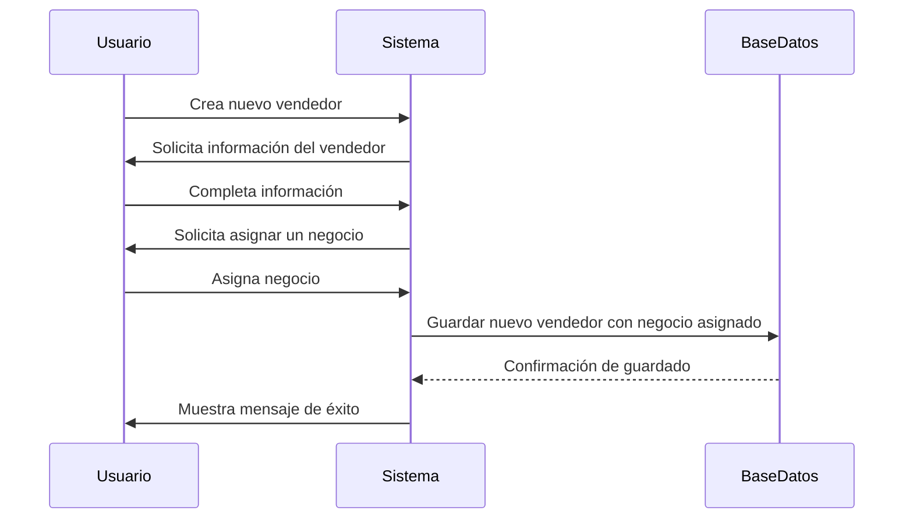

### Diagrama de secuencia: Validación de datos al registrar o actualizar vendedor
```mermaid
sequenceDiagram
    participant Usuario
    participant Sistema
    participant BaseDatos

    Usuario->>Sistema: Intenta guardar vendedor
    Sistema->>Sistema: Valida datos (nombre, correo, teléfono)
    Sistema-->>Usuario: Datos válidos
    Sistema->>BaseDatos: Guardar datos del vendedor
    BaseDatos-->>Sistema: Confirmación de guardado
    Sistema->>Usuario: Muestra mensaje de éxito
    Sistema-->>Usuario: Muestra mensaje de error si los datos no son válidos
```

### Diagrama de secuencia: Vendedor eliminado no aparece en la lista
```mermaid
sequenceDiagram
    participant Usuario
    participant Sistema
    participant BaseDatos

    Usuario->>Sistema: Visualiza lista de vendedores
    Sistema->>BaseDatos: Obtener lista de vendedores
    BaseDatos-->>Sistema: Lista de vendedores (sin el eliminado)
    Sistema->>Usuario: Muestra lista actualizada
```

### Diagrama de secuencia: Buscar vendedor específico por nombre o correo
```mermaid
sequenceDiagram
    participant Usuario
    participant Sistema
    participant BaseDatos

    Usuario->>Sistema: Inicia búsqueda por nombre o correo
    Sistema->>BaseDatos: Buscar vendedor por nombre o correo
    BaseDatos-->>Sistema: Resultados de búsqueda
    Sistema->>Usuario: Muestra resultados de búsqueda
```

### Diagrama de secuencia: Reflejo en tiempo real de cambios en la lista de vendedores
```mermaid
sequenceDiagram
    participant Usuario
    participant Sistema
    participant BaseDatos

    Usuario->>Sistema: Realiza cambio (crear, editar o eliminar vendedor)
    Sistema->>BaseDatos: Confirma cambio en la base de datos
    BaseDatos-->>Sistema: Confirmación de cambio
    Sistema->>Usuario: Muestra lista de vendedores actualizada en menos de 5 segundos
```

### Caso de Uso: Gestión de negocios
```mermaid
graph TB
    A[Vendedor] --> B[Crear negocio]
    A --> C[Editar negocio]
    A --> D[Eliminar negocio]
    B --> E[Negocio creado correctamente]
    C --> F[Cambios guardados correctamente]
    D --> G[Negocio eliminado correctamente]
```


### Diagrama de secuencia: Registrar o editar un negocio
```mermaid
sequenceDiagram
    participant Vendedor
    participant Sistema
    participant BaseDatos

    Vendedor->>Sistema: Accede al formulario para registrar/editar negocio
    Sistema->>Vendedor: Muestra campos para ingresar nombre, descripción y logo
    Vendedor->>Sistema: Ingresa la información del negocio
    Sistema->>BaseDatos: Guarda la información del negocio
    BaseDatos-->>Sistema: Confirmación de guardado
    Sistema->>Vendedor: Muestra mensaje de éxito
```

### Diagrama de secuencia: Guardar cambios en la información del negocio
```mermaid
sequenceDiagram
    participant Vendedor
    participant Sistema
    participant BaseDatos

    Vendedor->>Sistema: Realiza cambios en la información del negocio
    Sistema->>BaseDatos: Guarda los cambios realizados
    BaseDatos-->>Sistema: Confirmación de actualización
    Sistema->>Vendedor: Muestra mensaje de éxito
    Sistema->>Vendedor: Actualiza la vista con la nueva información
```

### Diagrama de secuencia: Eliminar un negocio y sus productos asociados
```mermaid
sequenceDiagram
    participant Vendedor
    participant Sistema
    participant BaseDatos

    Vendedor->>Sistema: Selecciona eliminar un negocio
    Sistema->>Vendedor: Pide confirmación de eliminación
    Vendedor->>Sistema: Confirma eliminación
    Sistema->>BaseDatos: Elimina el negocio y productos asociados
    BaseDatos-->>Sistema: Confirmación de eliminación
    Sistema->>Vendedor: Muestra mensaje de éxito
```

### Diagrama de secuencia: Acceder y editar/eliminar solo negocios propios
```mermaid
sequenceDiagram
    participant Vendedor
    participant Sistema
    participant BaseDatos

    Vendedor->>Sistema: Accede a la lista de negocios
    Sistema->>BaseDatos: Consulta los negocios del vendedor
    BaseDatos-->>Sistema: Negocios del vendedor
    Vendedor->>Sistema: Selecciona un negocio que le pertenece
    Sistema->>Vendedor: Muestra opciones de editar y eliminar
    Vendedor->>Sistema: Edita o elimina su negocio
    Sistema->>BaseDatos: Guarda los cambios o elimina el negocio
    BaseDatos-->>Sistema: Confirmación de cambio/eliminación
    Sistema->>Vendedor: Muestra mensaje de éxito
```

### Diagrama de secuencia: Ver solo negocios activos como cliente
```mermaid
sequenceDiagram
    participant Cliente
    participant Sistema
    participant BaseDatos

    Cliente->>Sistema: Accede a la lista de negocios
    Sistema->>BaseDatos: Consulta todos los negocios activos
    BaseDatos-->>Sistema: Lista de negocios activos
    Sistema->>Cliente: Muestra los negocios activos
```

### Diagrama de secuencia: Carga de imagen de logo en menos de 3 segundos
```mermaid
sequenceDiagram
    participant Vendedor
    participant Sistema

    Vendedor->>Sistema: Subir logo del negocio
    Sistema->>Sistema: Procesar la carga de la imagen
    Sistema-->>Vendedor: Confirmación de carga completada en menos de 3 segundos
```

### Diagrama de secuencia: Subir logo de hasta 5 MB
```mermaid
sequenceDiagram
    participant Vendedor
    participant Sistema

    Vendedor->>Sistema: Selecciona imagen de logo
    Sistema->>Sistema: Verifica tamaño de la imagen
    alt Si la imagen es válida (menos de 5 MB)
        Sistema->>Vendedor: Procesar carga de logo
        Sistema-->>Vendedor: Confirma carga completada
    else Si la imagen es mayor de 5 MB
        Sistema->>Vendedor: Muestra error "Tamaño de imagen demasiado grande"
    end
```

### Caso de Uso: Publicación de productos
```mermaid
graph TB
    A[Vendedor] --> B[Agregar producto con descuento]
    B --> C[Producto agregado al negocio]
    C --> D[Producto visible para clientes]
```

### Diagrama de secuencia: Publicar un nuevo producto
```mermaid
sequenceDiagram
    participant Vendedor
    participant Sistema
    participant BaseDatos

    Vendedor->>Sistema: Accede al formulario de publicación
    Sistema->>Vendedor: Muestra campos para nombre, descripción, precio, descuento y fecha de vencimiento
    Vendedor->>Sistema: Completa la información del producto
    Sistema->>BaseDatos: Guarda la información del producto
    BaseDatos-->>Sistema: Confirmación de guardado
    Sistema->>Vendedor: Muestra mensaje de éxito
```

### Diagrama de secuencia: No permitir guardar producto sin negocio asociado
```mermaid
sequenceDiagram
    participant Vendedor
    participant Sistema
    participant BaseDatos

    Vendedor->>Sistema: Intenta guardar un nuevo producto
    Sistema->>BaseDatos: Verifica si el producto tiene un negocio asociado
    alt Si no hay negocio asociado
        Sistema->>Vendedor: Muestra mensaje de error "No hay negocio asociado"
    else Si hay negocio asociado
        Sistema->>BaseDatos: Guarda el producto
        BaseDatos-->>Sistema: Confirmación de guardado
        Sistema->>Vendedor: Muestra mensaje de éxito
    end
```

### Diagrama de secuencia: Descuento mayor al 90%
```mermaid
sequenceDiagram
    participant Vendedor
    participant Sistema

    Vendedor->>Sistema: Ingresa un valor de descuento para el producto
    Sistema->>Sistema: Verifica si el descuento supera el 90%
    alt Si el descuento es mayor al 90%
        Sistema->>Vendedor: Muestra mensaje de error "Descuento no puede superar el 90%"
    else Si el descuento es válido
        Sistema->>BaseDatos: Guarda el producto con el descuento
        BaseDatos-->>Sistema: Confirmación de guardado
        Sistema->>Vendedor: Muestra mensaje de éxito
    end
```

### Diagrama de secuencia: Ordenar productos por proximidad de vencimiento
```mermaid
sequenceDiagram
    participant Cliente
    participant Sistema
    participant BaseDatos

    Cliente->>Sistema: Accede a la lista de productos
    Sistema->>BaseDatos: Obtiene productos con fecha de vencimiento
    BaseDatos-->>Sistema: Lista de productos con fecha de vencimiento
    Sistema->>Sistema: Ordena productos por proximidad de vencimiento
    Sistema->>Cliente: Muestra lista ordenada con productos más cercanos a vencer primero
```

### Diagrama de secuencia: Ver precio original y con descuento
```mermaid
sequenceDiagram
    participant Cliente
    participant Sistema

    Cliente->>Sistema: Visualiza producto con descuento
    Sistema->>Cliente: Muestra precio original y precio con descuento aplicado
    Sistema-->>Cliente: Muestra los dos precios (original y con descuento)
```

### Diagrama de secuencia: Tiempo de carga del formulario de productos
```mermaid
sequenceDiagram
    participant Vendedor
    participant Sistema

    Vendedor->>Sistema: Accede al formulario de productos
    Sistema->>Sistema: Carga formulario de publicación
    alt Si el tiempo de carga es menor o igual a 2 segundos
        Sistema->>Vendedor: Muestra el formulario correctamente
    else Si el tiempo de carga supera los 2 segundos
        Sistema->>Vendedor: Muestra mensaje de error de carga lenta
    end
```

### Diagrama de secuencia: Procesamiento de imágenes de productos
```mermaid
sequenceDiagram
    participant Vendedor
    participant Sistema

    Vendedor->>Sistema: Sube imagen del producto
    Sistema->>Sistema: Procesa la imagen
    Sistema->>Sistema: Comprime la imagen sin pérdida de calidad
    Sistema-->>Vendedor: Confirma carga y compresión de la imagen
```

### Caso de Uso: Recuperacion de contraseña 
```mermaid
graph TB
    A[Usuario registrado] --> B[Solicitar recuperación de contraseña]
    B --> C[Ingresar correo asociado a la cuenta]
    C --> D[Validar correo]
    D --> E{¿Correo válido?}
    E -- No --> F[Mostrar mensaje de error]
    E -- Sí --> G[Enviar enlace de recuperación]
    G --> H[Acceder a la página para restablecer contraseña]
    H --> I[Restablecer contraseña]
    I --> J[Contraseña restablecida correctamente]
```

### Diagrama de secuencia: Solicitar recuperación de contraseña
```mermaid
sequenceDiagram
    participant Usuario
    participant Sistema
    participant BaseDatos

    Usuario->>Sistema: Solicita recuperación de contraseña
    Sistema->>Usuario: Solicita ingreso de correo electrónico
    Usuario->>Sistema: Ingresa correo electrónico
    Sistema->>BaseDatos: Verifica si el correo existe
    alt Si el correo existe
        Sistema->>Usuario: Envia enlace para restablecer la contraseña
    else Si el correo no existe
        Sistema->>Usuario: Muestra mensaje de error "Correo no registrado"
    end
```

### Diagrama de secuencia: Enviar enlace para restablecer contraseña
```mermaid
sequenceDiagram
    participant Usuario
    participant Sistema
    participant Correo

    Usuario->>Sistema: Solicita enlace de restablecimiento
    Sistema->>Correo: Envía correo con enlace para restablecer contraseña
    Correo-->>Usuario: Recibe enlace para restablecer la contraseña
```

### Diagrama de secuencia: Restablecer contraseña con enlace
```mermaid
sequenceDiagram
    participant Usuario
    participant Sistema

    Usuario->>Sistema: Hace clic en el enlace de restablecimiento
    Sistema->>Usuario: Solicita nueva contraseña
    Usuario->>Sistema: Ingresa nueva contraseña
    Sistema->>Sistema: Valida si la nueva contraseña cumple con las políticas de seguridad
    alt Si la contraseña es válida
        Sistema->>Usuario: Restablece la contraseña y muestra mensaje de éxito
    else Si la contraseña no cumple con las políticas
        Sistema->>Usuario: Muestra mensaje de error de política de seguridad
    end
```

### Diagrama de secuencia: Validación de nueva contraseña
```mermaid
sequenceDiagram
    participant Usuario
    participant Sistema

    Usuario->>Sistema: Ingresa nueva contraseña
    Sistema->>Sistema: Verifica longitud y complejidad de la contraseña
    alt Si la contraseña cumple con las políticas
        Sistema->>Usuario: Muestra mensaje de éxito, la contraseña ha sido actualizada
    else Si la contraseña no cumple
        Sistema->>Usuario: Muestra mensaje de error "Contraseña no segura"
    end
```

### Diagrama de secuencia: Iniciar sesión con la nueva contraseña
```mermaid
sequenceDiagram
    participant Usuario
    participant Sistema

    Usuario->>Sistema: Inicia sesión con nueva contraseña
    Sistema->>Sistema: Verifica las credenciales
    alt Si la contraseña es correcta
        Sistema->>Usuario: Muestra mensaje de éxito "Inicio de sesión exitoso"
    else Si la contraseña es incorrecta
        Sistema->>Usuario: Muestra mensaje de error "Contraseña incorrecta"
    end
```
### Diagrama de secuencia: Enviar correo en menos de 1 minuto
```mermaid
sequenceDiagram
    participant Usuario
    participant Sistema
    participant Correo

    Usuario->>Sistema: Solicita recuperación de contraseña
    Sistema->>Correo: Procesa solicitud de correo
    Correo-->>Sistema: Enlace enviado
    Sistema->>Usuario: Notifica que el correo fue enviado en menos de 1 minuto
```

### Diagrama de secuencia: Cumplir con las políticas de seguridad de la nueva contraseña
```mermaid
sequenceDiagram
    participant Usuario
    participant Sistema

    Usuario->>Sistema: Ingresa nueva contraseña
    Sistema->>Sistema: Verifica longitud mínima y complejidad (mayúsculas, números, etc.)
    alt Si la contraseña cumple
        Sistema->>Usuario: Confirma que la contraseña cumple con las políticas de seguridad
    else Si la contraseña no cumple
        Sistema->>Usuario: Muestra mensaje de error "La contraseña no cumple con los requisitos de seguridad"
    end
```

### Caso de Uso: Visualizacion de Negocios
```mermaid
graph TB
    A[Cliente] --> B[Ver lista de negocios disponibles]
    B --> C[Explorar los productos del negocio]
```

### Diagrama de secuencia: Ver nombre, descripción y logo de cada negocio
```mermaid
sequenceDiagram
    participant Cliente
    participant Sistema
    participant BaseDatos

    Cliente->>Sistema: Accede a la lista de negocios
    Sistema->>BaseDatos: Consulta los negocios registrados
    BaseDatos-->>Sistema: Devuelve lista de negocios
    Sistema->>Cliente: Muestra lista con nombre, descripción y logo de cada negocio
```

### Diagrama de secuencia: Ver productos asociados a un negocio
```mermaid
sequenceDiagram
    participant Cliente
    participant Sistema
    participant BaseDatos

    Cliente->>Sistema: Hace clic en un negocio
    Sistema->>BaseDatos: Consulta los productos asociados al negocio
    BaseDatos-->>Sistema: Devuelve lista de productos
    Sistema->>Cliente: Muestra los productos disponibles con nombre, descripción y precio
```

### Diagrama de secuencia: Ver lista de productos en la vista del negocio
```mermaid
sequenceDiagram
    participant Cliente
    participant Sistema
    participant BaseDatos

    Cliente->>Sistema: Accede a la vista de un negocio
    Sistema->>BaseDatos: Consulta los productos disponibles de ese negocio
    BaseDatos-->>Sistema: Devuelve lista de productos
    Sistema->>Cliente: Muestra lista de productos con nombre, descripción y precio
```

### Diagrama de secuencia: Mensaje cuando no hay negocios registrados
```mermaid
sequenceDiagram
    participant Cliente
    participant Sistema
    participant BaseDatos

    Cliente->>Sistema: Accede a la lista de negocios
    Sistema->>BaseDatos: Consulta los negocios registrados
    alt Si no hay negocios registrados
        Sistema->>Cliente: Muestra mensaje "No hay negocios registrados actualmente"
    else Si hay negocios registrados
        BaseDatos-->>Sistema: Devuelve lista de negocios
        Sistema->>Cliente: Muestra la lista de negocios
    end
```

### Diagrama de secuencia: Ordenar negocios por nombre, ubicación o tipo de producto
```mermaid
sequenceDiagram
    participant Cliente
    participant Sistema
    participant BaseDatos

    Cliente->>Sistema: Accede a la lista de negocios
    Sistema->>Cliente: Muestra opciones de ordenación (nombre, ubicación, tipo de producto)
    Cliente->>Sistema: Selecciona opción de ordenación
    Sistema->>BaseDatos: Consulta negocios ordenados por la preferencia
    BaseDatos-->>Sistema: Devuelve lista ordenada
    Sistema->>Cliente: Muestra lista de negocios ordenada según la preferencia
```

### Digrama de secuencia: Tiempo de carga de la lista de negocios (menos de 3 segundos)
```mermaid
sequenceDiagram
    participant Cliente
    participant Sistema
    participant BaseDatos

    Cliente->>Sistema: Accede a la lista de negocios
    Sistema->>BaseDatos: Consulta los negocios registrados
    BaseDatos-->>Sistema: Devuelve lista de negocios
    alt Si el tiempo de carga es menor a 3 segundos
        Sistema->>Cliente: Muestra la lista de negocios rápidamente
    else Si el tiempo de carga supera los 3 segundos
        Sistema->>Cliente: Muestra mensaje de error de carga lenta
    end
```

### Diagrama de secuencia: Accesibilidad en dispositivos móviles
```mermaid
sequenceDiagram
    participant Cliente
    participant Sistema

    Cliente->>Sistema: Accede al sitio desde un dispositivo móvil
    Sistema->>Sistema: Verifica compatibilidad con dispositivos móviles
    alt Si el sistema es accesible
        Sistema->>Cliente: Muestra la plataforma optimizada para pantallas pequeñas
    else Si el sistema no es accesible
        Sistema->>Cliente: Muestra mensaje de error de incompatibilidad
    end
```

### Caso de Uso: Compra de Productos 

```mermaid
graph TB
    A[Cliente] --> B[Seleccionar producto]
    B --> C[Agregar producto al carrito de compras]
    C --> D[Producto agregado correctamente]
    D --> E[Visualizar carrito de compras]
```

### Diagrama de secuencia: Ver y agregar un producto al carrito
```mermaid
sequenceDiagram
    participant Cliente
    participant Sistema
    participant Carrito

    Cliente->>Sistema: Ve un producto disponible
    Sistema->>Cliente: Muestra información del producto
    Cliente->>Sistema: Hace clic en "Agregar al carrito"
    Sistema->>Carrito: Añadir el producto al carrito
    Carrito-->>Sistema: Producto añadido al carrito
    Sistema->>Cliente: Muestra notificación visual de éxito
```

### Diagrama de secuencia: Calcular el total con descuentos aplicados
```mermaid
sequenceDiagram
    participant Cliente
    participant Sistema
    participant Carrito

    Cliente->>Sistema: Ve los productos en el carrito
    Sistema->>Carrito: Calcula el total con descuentos aplicados
    Carrito-->>Sistema: Total calculado
    Sistema->>Cliente: Muestra el total actualizado con descuento
```

### Diagrama de secuencia: Eliminar un producto del carrito
```mermaid
sequenceDiagram
    participant Cliente
    participant Sistema
    participant Carrito

    Cliente->>Sistema: Elimina un producto del carrito
    Sistema->>Carrito: Elimina el producto seleccionado
    Carrito-->>Sistema: Producto eliminado correctamente
    Sistema->>Cliente: Muestra el carrito actualizado con el nuevo total
```

### Diagrama de secuencia: Ver el número total de productos y el subtotal
```mermaid
sequenceDiagram
    participant Cliente
    participant Sistema
    participant Carrito

    Cliente->>Sistema: Accede al carrito
    Sistema->>Carrito: Consulta el número total de productos y el subtotal
    Carrito-->>Sistema: Devuelve número total de productos y subtotal
    Sistema->>Cliente: Muestra número total de productos y subtotal
```

### Diagrama de secuencia: Notificación visual al añadir productos al carrito
```mermaid
sequenceDiagram
    participant Cliente
    participant Sistema
    participant Carrito

    Cliente->>Sistema: Añade un producto al carrito
    Sistema->>Carrito: Añadir el producto al carrito
    Carrito-->>Sistema: Producto añadido
    Sistema->>Cliente: Muestra notificación visual de éxito
```

### Diagrama de secuencia: Actualización en tiempo real del carrito sin recargar la página
```mermaid
sequenceDiagram
    participant Cliente
    participant Sistema
    participant Carrito

    Cliente->>Sistema: Realiza un cambio en el carrito (añadir, eliminar productos)
    Sistema->>Carrito: Actualiza el carrito en tiempo real
    Carrito-->>Sistema: Carrito actualizado
    Sistema->>Cliente: Muestra el carrito actualizado sin recargar la página
```

### Diagrama de secuencia: Proceso de pago seguro con cifrado
```mermaid
sequenceDiagram
    participant Cliente
    participant Sistema
    participant ProcesadorDePago

    Cliente->>Sistema: Procede con el pago
    Sistema->>ProcesadorDePago: Solicita procesamiento seguro de pago
    ProcesadorDePago->>Sistema: Procesa pago cumpliendo con los estándares de cifrado
    Sistema->>Cliente: Muestra confirmación de pago exitoso
```

### Caso de Uso: Reportes 

```mermaid
graph TB
    A[Administrador] --> B[Generar reporte de ventas]
    A --> C[Generar reporte de productos]
    B --> D[Reporte de ventas generado]
    C --> E[Reporte de productos generado]
    D --> F[Evaluar rendimiento de la plataforma]
    E --> F
```

### Diagrama de secuencia: Generar reporte con ventas totales, productos vendidos y clientes atendidos
```mermaid
sequenceDiagram
    participant Admin
    participant Sistema
    participant BaseDatos

    Admin->>Sistema: Solicita generar reporte
    Sistema->>BaseDatos: Consulta ventas totales, productos vendidos y clientes atendidos
    BaseDatos-->>Sistema: Devuelve los datos
    Sistema->>Admin: Muestra ventas totales, productos vendidos y clientes atendidos
```

### Diagrama de secuencia: Generar reporte con un rango de fechas filtrado
```mermaid
sequenceDiagram
    participant Admin
    participant Sistema
    participant BaseDatos

    Admin->>Sistema: Solicita generar reporte con rango de fechas
    Sistema->>BaseDatos: Filtra datos según el rango de fechas seleccionado
    BaseDatos-->>Sistema: Devuelve datos filtrados
    Sistema->>Admin: Muestra reporte con los datos filtrados por fecha
```

### Diagrama de secuencia: Generar reporte con formato gráfico
```mermaid
sequenceDiagram
    participant Admin
    participant Sistema
    participant BaseDatos

    Admin->>Sistema: Solicita generar reporte gráfico
    Sistema->>BaseDatos: Consulta datos de ventas, productos y clientes
    BaseDatos-->>Sistema: Devuelve los datos requeridos
    Sistema->>Admin: Muestra los datos en formato gráfico
```

### Diagrama de secuencia: Filtrar datos por vendedor, negocio o producto
```mermaid
sequenceDiagram
    participant Admin
    participant Sistema
    participant BaseDatos

    Admin->>Sistema: Solicita generar reporte filtrado por vendedor, negocio o producto
    Sistema->>BaseDatos: Filtra datos por vendedor, negocio o producto seleccionado
    BaseDatos-->>Sistema: Devuelve datos filtrados
    Sistema->>Admin: Muestra reporte con los datos filtrados
```

### Diagrama de secuencia: Acceso restringido a reportes solo para administradores autenticados
```mermaid
sequenceDiagram
    participant Admin
    participant Sistema
    participant BaseDatos

    Admin->>Sistema: Solicita acceder a los reportes
    Sistema->>BaseDatos: Verifica si el usuario es un administrador autenticado
    alt Si es administrador autenticado
        BaseDatos-->>Sistema: Permite acceso a los reportes
        Sistema->>Admin: Muestra los reportes
    else Si no es administrador autenticado
        BaseDatos-->>Sistema: Niega el acceso
        Sistema->>Admin: Muestra mensaje de error "Acceso denegado"
    end
```

### Diagrama de secuencia: Generar reporte en menos de 5 segundos
```mermaid
sequenceDiagram
    participant Admin
    participant Sistema
    participant BaseDatos

    Admin->>Sistema: Solicita generar reporte
    Sistema->>BaseDatos: Consulta los datos necesarios
    BaseDatos-->>Sistema: Devuelve los datos
    alt Si el tiempo de generación es menor a 5 segundos
        Sistema->>Admin: Muestra el reporte generado
    else Si el tiempo de generación supera los 5 segundos
        Sistema->>Admin: Muestra mensaje de error "Tiempo de generación excedido"
    end
```

### Diagrama de secuencia: Exportar reporte a PDF
```mermaid
sequenceDiagram
    participant Admin
    participant Sistema

    Admin->>Sistema: Solicita exportar reporte
    Sistema->>Sistema: Genera el reporte en formato PDF
    Sistema-->>Admin: Entrega el archivo PDF
```

### Caso de Uso: Notificaciones 

```mermaid
graph TB
    A[Cliente] --> B[Suscribirse a notificaciones]
    B --> C[Recibir notificación de nuevos productos]
    C --> D[Ver detalles del producto]
    D --> E[Aprovechar ofertas antes de que se agoten]
```

### Diagrama de secuencia: Recibir notificaciones por correo electrónico al suscribirse a una categoría de productos o negocios
```mermaid
sequenceDiagram
    participant Cliente
    participant Sistema
    participant BaseDatos
    participant Correo

    Cliente->>Sistema: Se suscribe a una categoría de productos o negocios
    Sistema->>BaseDatos: Registra suscripción del cliente
    BaseDatos-->>Sistema: Confirmación de suscripción
    Sistema->>Correo: Envía notificación por correo electrónico sobre nuevos productos en la categoría
    Correo-->>Cliente: Recibe notificación con nuevos productos
```

### Diagrama de secuencia: No recibir notificaciones si el vendedor desactiva las notificaciones de un producto
```mermaid
sequenceDiagram
    participant Cliente
    participant Sistema
    participant Vendedor
    participant BaseDatos

    Cliente->>Sistema: Se suscribe a un producto
    Sistema->>BaseDatos: Registra la suscripción del cliente
    BaseDatos-->>Sistema: Confirmación de suscripción
    Vendedor->>Sistema: Desactiva notificaciones del producto
    Sistema->>BaseDatos: Desactiva notificaciones para el cliente sobre ese producto
    BaseDatos-->>Sistema: Confirmación de desactivación
    Cliente->>Sistema: No recibe notificación sobre el producto desactivado
```

### Diagrama de secuencia: Recibir notificaciones con detalles del producto
```mermaid
sequenceDiagram
    participant Cliente
    participant Sistema
    participant Correo

    Cliente->>Sistema: Recibe notificación de un nuevo producto
    Sistema->>Correo: Genera correo con nombre, precio y fecha de vencimiento del producto
    Correo-->>Cliente: Recibe correo con detalles del producto (nombre, precio, fecha de vencimiento)
```

### Diagrama de secuencia: Elegir cómo recibir las notificaciones (correo electrónico, SMS, o ambas)
```mermaid
sequenceDiagram
    participant Cliente
    participant Sistema
    participant BaseDatos

    Cliente->>Sistema: Se suscribe a notificaciones
    Sistema->>Cliente: Solicita elección de canal de notificación (correo, SMS o ambos)
    Cliente->>Sistema: Elige recibir notificaciones por correo y SMS
    Sistema->>BaseDatos: Registra la preferencia de notificación
    BaseDatos-->>Sistema: Confirmación de preferencia registrada
    Sistema->>Cliente: Envia notificaciones a través de los canales seleccionados
```

### Diagrama de secuencia: Recibir notificaciones fáciles de leer con enlace directo al producto
```mermaid
sequenceDiagram
    participant Cliente
    participant Sistema
    participant Correo

    Cliente->>Sistema: Recibe notificación
    Sistema->>Correo: Genera notificación fácil de leer con enlace directo al producto
    Correo-->>Cliente: Recibe correo con enlace directo al producto en la web
```

### Diagrama de secuencia: Enviar notificaciones en menos de 1 minuto
```mermaid
sequenceDiagram
    participant Cliente
    participant Sistema
    participant Correo

    Cliente->>Sistema: Se suscribe a notificaciones
    Sistema->>Correo: Procesa envío de notificación
    alt Si la notificación se envía en menos de 1 minuto
        Correo-->>Cliente: Recibe notificación
    else Si la notificación supera 1 minuto
        Sistema->>Cliente: Muestra mensaje de error "Notificación retrasada"
    end
```

### Diagrama de secuencia: Manejar hasta 100 notificaciones por minuto
```mermaid
sequenceDiagram
    participant Admin
    participant Sistema
    participant Correo

    Admin->>Sistema: Activa el sistema de notificaciones
    Sistema->>Correo: Envía notificaciones a los clientes
    alt Si se envían menos de 100 notificaciones por minuto
        Correo-->>Cliente: Reciben las notificaciones correctamente
    else Si se envían más de 100 notificaciones por minuto
        Sistema->>Correo: Mantiene el rendimiento y procesa todas las notificaciones
        Correo-->>Cliente: Reciben todas las notificaciones sin demora
    end
```


### Diagramas secuencia - SAD 

Diagrama de Secuencia: Acceso al Formulario de Registro
```mermaid
sequenceDiagram
    participant Visitante
    participant Sistema

    Visitante->>Sistema: Solicita acceso al formulario de registro
    Sistema-->>Visitante: Muestra formulario de registro
    Visitante->>Sistema: Completa los campos (nombre, correo, contraseña)
    Sistema-->>Sistema: Valida campos obligatorios
    Sistema-->>Visitante: Permite continuar si los campos son válidos
```

Diagrama de Secuencia: Asignación de Rol de Cliente
```mermaid
sequenceDiagram
    participant Cliente
    participant Sistema

    Cliente->>Sistema: Completa el registro
    Sistema-->>Cliente: Asigna rol de cliente automáticamente
    Sistema-->>Cliente: Confirma registro exitoso
```

Diagrama de Secuencia: Creación de Cuenta por Administrador
```mermaid
sequenceDiagram
    participant Vendedor
    participant Sistema
    participant Administrador

    Vendedor->>Sistema: Completa registro
    Sistema-->>Administrador: Notifica creación de cuenta pendiente
    Administrador->>Sistema: Aprueba o rechaza la cuenta
    Sistema-->>Vendedor: Notifica estado de la cuenta
```

Diagrama de Secuencia: Validación de Correo Único
```mermaid
sequenceDiagram
    participant Usuario
    participant Sistema

    Usuario->>Sistema: Completa registro con correo
    Sistema-->>Sistema: Verifica si el correo ya está registrado
    alt Correo no único
        Sistema-->>Usuario: Muestra mensaje de error
    else Correo único
        Sistema-->>Usuario: Continúa con el registro
    end
```

Diagrama de Secuencia: Mensaje de Confirmación de Registro
```mermaid
sequenceDiagram
    participant Usuario
    participant Sistema

    Usuario->>Sistema: Completa registro exitosamente
    Sistema-->>Usuario: Muestra mensaje de confirmación
```

Diagrama de Secuencia: Tiempo de Carga del Formulario
```mermaid
sequenceDiagram
    participant Visitante
    participant Sistema

    Visitante->>Sistema: Accede al formulario de registro
    Sistema-->>Visitante: Muestra formulario en menos de 2 segundos
```

Diagrama de Secuencia: Cifrado de Contraseña
```mermaid
sequenceDiagram
    participant Usuario
    participant Sistema

    Usuario->>Sistema: Completa registro con contraseña
    Sistema-->>Sistema: Cifra la contraseña
    Sistema-->>Usuario: Confirma registro exitoso
```

Diagrama de Secuencia: Campos de Inicio de Sesión
```mermaid
sequenceDiagram
    participant Usuario
    participant Sistema

    Usuario->>Sistema: Accede al formulario de inicio de sesión
    Sistema-->>Usuario: Muestra campos para correo y contraseña
```

Diagrama de Secuencia: Mensaje de Error por Credenciales Incorrectas
```mermaid
sequenceDiagram
    participant Usuario
    participant Sistema

    Usuario->>Sistema: Intenta iniciar sesión con credenciales incorrectas
    Sistema-->>Sistema: Valida credenciales
    Sistema-->>Usuario: Muestra mensaje de error claro
```

Diagrama de Secuencia: Redirección según Rol
```mermaid
sequenceDiagram
    participant Usuario
    participant Sistema

    Usuario->>Sistema: Inicia sesión con credenciales correctas
    Sistema-->>Sistema: Verifica rol del usuario
    Sistema-->>Usuario: Redirige según rol (ej. cliente, vendedor, administrador)
```

Diagrama de Secuencia: Redirección para Administrador
```mermaid
sequenceDiagram
    participant Administrador
    participant Sistema

    Administrador->>Sistema: Inicia sesión
    Sistema-->>Sistema: Verifica rol de administrador
    Sistema-->>Administrador: Redirige a la vista de gestión de vendedores y negocios
```

Diagrama de Secuencia: Recuperación de Contraseña
```mermaid
sequenceDiagram
    participant Usuario
    participant Sistema

    Usuario->>Sistema: Solicita recuperación de contraseña
    Sistema-->>Usuario: Envía correo con enlace para restablecer contraseña
```

Diagrama de Secuencia: Inicio de Sesión en Menos de 3 Segundos
```mermaid
sequenceDiagram
    participant Usuario
    participant Sistema

    Usuario->>Sistema: Intenta iniciar sesión
    Sistema-->>Sistema: Valida credenciales
    Sistema-->>Usuario: Completa el inicio de sesión en menos de 3 segundos
```


Diagrama de Secuencia: Expiración de Sesión por Inactividad
```mermaid
sequenceDiagram
    participant Usuario
    participant Sistema

    Usuario->>Sistema: Está inactivo durante 30 minutos
    Sistema-->>Sistema: Detecta inactividad
    Sistema-->>Usuario: Expira sesión automáticamente
```


Diagrama de Secuencia: Opciones para Editar y Eliminar Vendedores
```mermaid
sequenceDiagram
    participant Usuario
    participant Sistema
    participant BaseDatos

    Usuario->>Sistema: Visualiza lista de vendedores
    Sistema->>BaseDatos: Obtener lista de vendedores
    BaseDatos-->>Sistema: Lista de vendedores
    Sistema->>Usuario: Muestra lista con opciones de editar y eliminar
```

Diagrama de Secuencia: Eliminar un Vendedor y sus Negocios y Productos
```mermaid
sequenceDiagram
    participant Usuario
    participant Sistema
    participant BaseDatos

    Usuario->>Sistema: Selecciona eliminar vendedor
    Sistema->>Usuario: Confirma eliminación
    Usuario->>Sistema: Confirma eliminación
    Sistema->>BaseDatos: Eliminar vendedor, negocios y productos asociados
    BaseDatos-->>Sistema: Confirmación de eliminación
    Sistema->>Usuario: Muestra mensaje de éxito
```

Diagrama de Secuencia: Asignar un Negocio al Vendedor al Crear uno Nuevo
```mermaid
sequenceDiagram
    participant Usuario
    participant Sistema
    participant BaseDatos

    Usuario->>Sistema: Crea nuevo vendedor
    Sistema->>Usuario: Solicita información del vendedor
    Usuario->>Sistema: Completa información
    Sistema->>Usuario: Solicita asignar un negocio
    Usuario->>Sistema: Asigna negocio
    Sistema->>BaseDatos: Guardar nuevo vendedor con negocio asignado
    BaseDatos-->>Sistema: Confirmación de guardado
    Sistema->>Usuario: Muestra mensaje de éxito
```

Diagrama de Secuencia: Validación de Datos al Registrar o Actualizar Vendedor
```mermaid
sequenceDiagram
    participant Usuario
    participant Sistema
    participant BaseDatos

    Usuario->>Sistema: Intenta guardar vendedor
    Sistema->>Sistema: Valida datos (nombre, correo, teléfono)
    Sistema-->>Usuario: Datos válidos
    Sistema->>BaseDatos: Guardar datos del vendedor
    BaseDatos-->>Sistema: Confirmación de guardado
    Sistema->>Usuario: Muestra mensaje de éxito
    Sistema-->>Usuario: Muestra mensaje de error si los datos no son válidos
```

Diagrama de Secuencia: Vendedor Eliminado no Aparece en la Lista
```mermaid
sequenceDiagram
    participant Usuario
    participant Sistema
    participant BaseDatos

    Usuario->>Sistema: Visualiza lista de vendedores
    Sistema->>BaseDatos: Obtener lista de vendedores
    BaseDatos-->>Sistema: Lista de vendedores (sin el eliminado)
    Sistema->>Usuario: Muestra lista actualizada
```

Diagrama de Secuencia: Buscar Vendedor Específico por Nombre o Correo
```mermaid
sequenceDiagram
    participant Usuario
    participant Sistema
    participant BaseDatos

    Usuario->>Sistema: Inicia búsqueda por nombre o correo
    Sistema->>BaseDatos: Buscar vendedor por nombre o correo
    BaseDatos-->>Sistema: Resultados de búsqueda
    Sistema->>Usuario: Muestra resultados de búsqueda
```

Diagrama de Secuencia: Reflejo en Tiempo Real de Cambios en la Lista de Vendedores
```mermaid
sequenceDiagram
    participant Usuario
    participant Sistema
    participant BaseDatos

    Usuario->>Sistema: Realiza cambio (crear, editar o eliminar vendedor)
    Sistema->>BaseDatos: Confirma cambio en la base de datos
    BaseDatos-->>Sistema: Confirmación de cambio
    Sistema->>Usuario: Muestra lista de vendedores actualizada en menos de 5 segundos
```

Registrar o editar un negocio
```mermaid
sequenceDiagram
    participant Vendedor
    participant Sistema
    participant BaseDatos

    Vendedor->>Sistema: Accede al formulario para registrar/editar negocio
    Sistema->>Vendedor: Muestra campos para ingresar nombre, descripción y logo
    Vendedor->>Sistema: Ingresa la información del negocio
    Sistema->>BaseDatos: Guarda la información del negocio
    BaseDatos-->>Sistema: Confirmación de guardado
    Sistema->>Vendedor: Muestra mensaje de éxito
```

Guardar cambios en la información del negocio
```mermaid
sequenceDiagram
    participant Vendedor
    participant Sistema
    participant BaseDatos

    Vendedor->>Sistema: Realiza cambios en la información del negocio
    Sistema->>BaseDatos: Guarda los cambios realizados
    BaseDatos-->>Sistema: Confirmación de actualización
    Sistema->>Vendedor: Muestra mensaje de éxito
    Sistema->>Vendedor: Actualiza la vista con la nueva información
```

Eliminar un negocio y sus productos asociados
```mermaid
sequenceDiagram
    participant Vendedor
    participant Sistema
    participant BaseDatos

    Vendedor->>Sistema: Selecciona eliminar un negocio
    Sistema->>Vendedor: Pide confirmación de eliminación
    Vendedor->>Sistema: Confirma eliminación
    Sistema->>BaseDatos: Elimina el negocio y productos asociados
    BaseDatos-->>Sistema: Confirmación de eliminación
    Sistema->>Vendedor: Muestra mensaje de éxito
```

Acceder y editar/eliminar solo negocios propios
```mermaid
sequenceDiagram
    participant Vendedor
    participant Sistema
    participant BaseDatos

    Vendedor->>Sistema: Accede a la lista de negocios
    Sistema->>BaseDatos: Consulta los negocios del vendedor
    BaseDatos-->>Sistema: Negocios del vendedor
    Vendedor->>Sistema: Selecciona un negocio que le pertenece
    Sistema->>Vendedor: Muestra opciones de editar y eliminar
    Vendedor->>Sistema: Edita o elimina su negocio
    Sistema->>BaseDatos: Guarda los cambios o elimina el negocio
    BaseDatos-->>Sistema: Confirmación de cambio/eliminación
    Sistema->>Vendedor: Muestra mensaje de éxito
```

Ver solo negocios activos como cliente
```mermaid
sequenceDiagram
    participant Cliente
    participant Sistema
    participant BaseDatos

    Cliente->>Sistema: Accede a la lista de negocios
    Sistema->>BaseDatos: Consulta todos los negocios activos
    BaseDatos-->>Sistema: Lista de negocios activos
    Sistema->>Cliente: Muestra los negocios activos
```

Carga de imagen de logo en menos de 3 segundos
```mermaid
sequenceDiagram
    participant Vendedor
    participant Sistema

    Vendedor->>Sistema: Subir logo del negocio
    Sistema->>Sistema: Procesar la carga de la imagen
    Sistema-->>Vendedor: Confirmación de carga completada en menos de 3 segundos
```

Subir logo de hasta 5 MB
```mermaid
sequenceDiagram
    participant Vendedor
    participant Sistema

    Vendedor->>Sistema: Selecciona imagen de logo
    Sistema->>Sistema: Verifica tamaño de la imagen
    alt Si la imagen es válida (menos de 5 MB)
        Sistema->>Vendedor: Procesar carga de logo
        Sistema-->>Vendedor: Confirma carga completada
    else Si la imagen es mayor de 5 MB
        Sistema->>Vendedor: Muestra error "Tamaño de imagen demasiado grande"
    end
```


Publicar un nuevo producto
```mermaid
sequenceDiagram
    participant Vendedor
    participant Sistema
    participant BaseDatos

    Vendedor->>Sistema: Accede al formulario de publicación
    Sistema->>Vendedor: Muestra campos para nombre, descripción, precio, descuento y fecha de vencimiento
    Vendedor->>Sistema: Completa la información del producto
    Sistema->>BaseDatos: Guarda la información del producto
    BaseDatos-->>Sistema: Confirmación de guardado
    Sistema->>Vendedor: Muestra mensaje de éxito
```

No permitir guardar producto sin negocio asociado
```mermaid
sequenceDiagram
    participant Vendedor
    participant Sistema
    participant BaseDatos

    Vendedor->>Sistema: Intenta guardar un nuevo producto
    Sistema->>BaseDatos: Verifica si el producto tiene un negocio asociado
    alt Si no hay negocio asociado
        Sistema->>Vendedor: Muestra mensaje de error "No hay negocio asociado"
    else Si hay negocio asociado
        Sistema->>BaseDatos: Guarda el producto
        BaseDatos-->>Sistema: Confirmación de guardado
        Sistema->>Vendedor: Muestra mensaje de éxito
    end
```

Descuento mayor al 90%
```mermaid
sequenceDiagram
    participant Vendedor
    participant Sistema

    Vendedor->>Sistema: Ingresa un valor de descuento para el producto
    Sistema->>Sistema: Verifica si el descuento supera el 90%
    alt Si el descuento es mayor al 90%
        Sistema->>Vendedor: Muestra mensaje de error "Descuento no puede superar el 90%"
    else Si el descuento es válido
        Sistema->>BaseDatos: Guarda el producto con el descuento
        BaseDatos-->>Sistema: Confirmación de guardado
        Sistema->>Vendedor: Muestra mensaje de éxito
    end
```

Ordenar productos por proximidad de vencimiento
```mermaid
sequenceDiagram
    participant Cliente
    participant Sistema
    participant BaseDatos

    Cliente->>Sistema: Accede a la lista de productos
    Sistema->>BaseDatos: Obtiene productos con fecha de vencimiento
    BaseDatos-->>Sistema: Lista de productos con fecha de vencimiento
    Sistema->>Sistema: Ordena productos por proximidad de vencimiento
    Sistema->>Cliente: Muestra lista ordenada con productos más cercanos a vencer primero
```


Ver precio original y con descuento
```mermaid
sequenceDiagram
    participant Cliente
    participant Sistema

    Cliente->>Sistema: Visualiza producto con descuento
    Sistema->>Cliente: Muestra precio original y precio con descuento aplicado
    Sistema-->>Cliente: Muestra los dos precios (original y con descuento)
```

Tiempo de carga del formulario de productos
```mermaid
sequenceDiagram
    participant Vendedor
    participant Sistema

    Vendedor->>Sistema: Accede al formulario de productos
    Sistema->>Sistema: Carga formulario de publicación
    alt Si el tiempo de carga es menor o igual a 2 segundos
        Sistema->>Vendedor: Muestra el formulario correctamente
    else Si el tiempo de carga supera los 2 segundos
        Sistema->>Vendedor: Muestra mensaje de error de carga lenta
    end
```

Procesamiento de imágenes de productos
```mermaid
sequenceDiagram
    participant Vendedor
    participant Sistema

    Vendedor->>Sistema: Sube imagen del producto
    Sistema->>Sistema: Procesa la imagen
    Sistema->>Sistema: Comprime la imagen sin pérdida de calidad
    Sistema-->>Vendedor: Confirma carga y compresión de la imagen
```

Solicitar recuperación de contraseña
```mermaid
sequenceDiagram
    participant Usuario
    participant Sistema
    participant BaseDatos

    Usuario->>Sistema: Solicita recuperación de contraseña
    Sistema->>Usuario: Solicita ingreso de correo electrónico
    Usuario->>Sistema: Ingresa correo electrónico
    Sistema->>BaseDatos: Verifica si el correo existe
    alt Si el correo existe
        Sistema->>Usuario: Envia enlace para restablecer la contraseña
    else Si el correo no existe
        Sistema->>Usuario: Muestra mensaje de error "Correo no registrado"
    end
```

Enviar enlace para restablecer contraseña
```mermaid
sequenceDiagram
    participant Usuario
    participant Sistema
    participant Correo

    Usuario->>Sistema: Solicita enlace de restablecimiento
    Sistema->>Correo: Envía correo con enlace para restablecer contraseña
    Correo-->>Usuario: Recibe enlace para restablecer la contraseña
```

Restablecer contraseña con enlace
```mermaid
sequenceDiagram
    participant Usuario
    participant Sistema

    Usuario->>Sistema: Hace clic en el enlace de restablecimiento
    Sistema->>Usuario: Solicita nueva contraseña
    Usuario->>Sistema: Ingresa nueva contraseña
    Sistema->>Sistema: Valida si la nueva contraseña cumple con las políticas de seguridad
    alt Si la contraseña es válida
        Sistema->>Usuario: Restablece la contraseña y muestra mensaje de éxito
    else Si la contraseña no cumple con las políticas
        Sistema->>Usuario: Muestra mensaje de error de política de seguridad
    end
```

Validación de nueva contraseña
```mermaid
sequenceDiagram
    participant Usuario
    participant Sistema

    Usuario->>Sistema: Ingresa nueva contraseña
    Sistema->>Sistema: Verifica longitud y complejidad de la contraseña
    alt Si la contraseña cumple con las políticas
        Sistema->>Usuario: Muestra mensaje de éxito, la contraseña ha sido actualizada
    else Si la contraseña no cumple
        Sistema->>Usuario: Muestra mensaje de error "Contraseña no segura"
    end
```

Iniciar sesión con la nueva contraseña
```mermaid
sequenceDiagram
    participant Usuario
    participant Sistema

    Usuario->>Sistema: Inicia sesión con nueva contraseña
    Sistema->>Sistema: Verifica las credenciales
    alt Si la contraseña es correcta
        Sistema->>Usuario: Muestra mensaje de éxito "Inicio de sesión exitoso"
    else Si la contraseña es incorrecta
        Sistema->>Usuario: Muestra mensaje de error "Contraseña incorrecta"
    end
```

Enviar correo en menos de 1 minuto
```mermaid
sequenceDiagram
    participant Usuario
    participant Sistema
    participant Correo

    Usuario->>Sistema: Solicita recuperación de contraseña
    Sistema->>Correo: Procesa solicitud de correo
    Correo-->>Sistema: Enlace enviado
    Sistema->>Usuario: Notifica que el correo fue enviado en menos de 1 minuto
```

Cumplir con las políticas de seguridad de la nueva contraseña
```mermaid
sequenceDiagram
    participant Usuario
    participant Sistema

    Usuario->>Sistema: Ingresa nueva contraseña
    Sistema->>Sistema: Verifica longitud mínima y complejidad (mayúsculas, números, etc.)
    alt Si la contraseña cumple
        Sistema->>Usuario: Confirma que la contraseña cumple con las políticas de seguridad
    else Si la contraseña no cumple
        Sistema->>Usuario: Muestra mensaje de error "La contraseña no cumple con los requisitos de seguridad"
    end
```

Solicitar recuperación de contraseña
```mermaid
sequenceDiagram
    participant Usuario
    participant Sistema
    participant BaseDatos

    Usuario->>Sistema: Solicita recuperación de contraseña
    Sistema->>Usuario: Solicita ingreso de correo electrónico
    Usuario->>Sistema: Ingresa correo electrónico
    Sistema->>BaseDatos: Verifica si el correo existe
    alt Si el correo existe
        Sistema->>Usuario: Envia enlace para restablecer la contraseña
    else Si el correo no existe
        Sistema->>Usuario: Muestra mensaje de error "Correo no registrado"
    end
```

Enviar enlace para restablecer contraseña
```mermaid
sequenceDiagram
    participant Usuario
    participant Sistema
    participant Correo

    Usuario->>Sistema: Solicita enlace de restablecimiento
    Sistema->>Correo: Envía correo con enlace para restablecer contraseña
    Correo-->>Usuario: Recibe enlace para restablecer la contraseña
```

Restablecer contraseña con enlace
```mermaid
sequenceDiagram
    participant Usuario
    participant Sistema

    Usuario->>Sistema: Hace clic en el enlace de restablecimiento
    Sistema->>Usuario: Solicita nueva contraseña
    Usuario->>Sistema: Ingresa nueva contraseña
    Sistema->>Sistema: Valida si la nueva contraseña cumple con las políticas de seguridad
    alt Si la contraseña es válida
        Sistema->>Usuario: Restablece la contraseña y muestra mensaje de éxito
    else Si la contraseña no cumple con las políticas
        Sistema->>Usuario: Muestra mensaje de error de política de seguridad
    end
```

Validación de nueva contraseña
```mermaid
sequenceDiagram
    participant Usuario
    participant Sistema

    Usuario->>Sistema: Ingresa nueva contraseña
    Sistema->>Sistema: Verifica longitud y complejidad de la contraseña
    alt Si la contraseña cumple con las políticas
        Sistema->>Usuario: Muestra mensaje de éxito, la contraseña ha sido actualizada
    else Si la contraseña no cumple
        Sistema->>Usuario: Muestra mensaje de error "Contraseña no segura"
    end
```

Iniciar sesión con la nueva contraseña
```mermaid
sequenceDiagram
    participant Usuario
    participant Sistema

    Usuario->>Sistema: Inicia sesión con nueva contraseña
    Sistema->>Sistema: Verifica las credenciales
    alt Si la contraseña es correcta
        Sistema->>Usuario: Muestra mensaje de éxito "Inicio de sesión exitoso"
    else Si la contraseña es incorrecta
        Sistema->>Usuario: Muestra mensaje de error "Contraseña incorrecta"
    end
```

Enviar correo en menos de 1 minuto
```mermaid
sequenceDiagram
    participant Usuario
    participant Sistema
    participant Correo

    Usuario->>Sistema: Solicita recuperación de contraseña
    Sistema->>Correo: Procesa solicitud de correo
    Correo-->>Sistema: Enlace enviado
    Sistema->>Usuario: Notifica que el correo fue enviado en menos de 1 minuto
```


Cumplir con las políticas de seguridad de la nueva contraseña
```mermaid
sequenceDiagram
    participant Usuario
    participant Sistema

    Usuario->>Sistema: Ingresa nueva contraseña
    Sistema->>Sistema: Verifica longitud mínima y complejidad (mayúsculas, números, etc.)
    alt Si la contraseña cumple
        Sistema->>Usuario: Confirma que la contraseña cumple con las políticas de seguridad
    else Si la contraseña no cumple
        Sistema->>Usuario: Muestra mensaje de error "La contraseña no cumple con los requisitos de seguridad"
    end
```


Ver nombre, descripción y logo de cada negocio
```mermaid
sequenceDiagram
    participant Cliente
    participant Sistema
    participant BaseDatos

    Cliente->>Sistema: Accede a la lista de negocios
    Sistema->>BaseDatos: Consulta los negocios registrados
    BaseDatos-->>Sistema: Devuelve lista de negocios
    Sistema->>Cliente: Muestra lista con nombre, descripción y logo de cada negocio
```

Ver productos asociados a un negocio
```mermaid
sequenceDiagram
    participant Cliente
    participant Sistema
    participant BaseDatos

    Cliente->>Sistema: Hace clic en un negocio
    Sistema->>BaseDatos: Consulta los productos asociados al negocio
    BaseDatos-->>Sistema: Devuelve lista de productos
    Sistema->>Cliente: Muestra los productos disponibles con nombre, descripción y precio
```

Ver lista de productos en la vista del negocio
```mermaid
sequenceDiagram
    participant Cliente
    participant Sistema
    participant BaseDatos

    Cliente->>Sistema: Accede a la vista de un negocio
    Sistema->>BaseDatos: Consulta los productos disponibles de ese negocio
    BaseDatos-->>Sistema: Devuelve lista de productos
    Sistema->>Cliente: Muestra lista de productos con nombre, descripción y precio
```

Mensaje cuando no hay negocios registrados
```mermaid
sequenceDiagram
    participant Cliente
    participant Sistema
    participant BaseDatos

    Cliente->>Sistema: Accede a la lista de negocios
    Sistema->>BaseDatos: Consulta los negocios registrados
    alt Si no hay negocios registrados
        Sistema->>Cliente: Muestra mensaje "No hay negocios registrados actualmente"
    else Si hay negocios registrados
        BaseDatos-->>Sistema: Devuelve lista de negocios
        Sistema->>Cliente: Muestra la lista de negocios
    end
```

Ordenar negocios por nombre, ubicación o tipo de producto
```mermaid
sequenceDiagram
    participant Cliente
    participant Sistema
    participant BaseDatos

    Cliente->>Sistema: Accede a la lista de negocios
    Sistema->>Cliente: Muestra opciones de ordenación (nombre, ubicación, tipo de producto)
    Cliente->>Sistema: Selecciona opción de ordenación
    Sistema->>BaseDatos: Consulta negocios ordenados por la preferencia
    BaseDatos-->>Sistema: Devuelve lista ordenada
    Sistema->>Cliente: Muestra lista de negocios ordenada según la preferencia
```

Tiempo de carga de la lista de negocios (menos de 3 segundos)
```mermaid
sequenceDiagram
    participant Cliente
    participant Sistema
    participant BaseDatos

    Cliente->>Sistema: Accede a la lista de negocios
    Sistema->>BaseDatos: Consulta los negocios registrados
    BaseDatos-->>Sistema: Devuelve lista de negocios
    alt Si el tiempo de carga es menor a 3 segundos
        Sistema->>Cliente: Muestra la lista de negocios rápidamente
    else Si el tiempo de carga supera los 3 segundos
        Sistema->>Cliente: Muestra mensaje de error de carga lenta
    end
```

Diagrama de secuencia SAD: Accesibilidad en dispositivos móviles
```mermaid
sequenceDiagram
    participant Cliente
    participant Sistema

    Cliente->>Sistema: Accede al sitio desde un dispositivo móvil
    Sistema->>Sistema: Verifica compatibilidad con dispositivos móviles
    alt Si el sistema es accesible
        Sistema->>Cliente: Muestra la plataforma optimizada para pantallas pequeñas
    else Si el sistema no es accesible
        Sistema->>Cliente: Muestra mensaje de error de incompatibilidad
    end
```

Ver y agregar un producto al carrito
```mermaid
sequenceDiagram
    participant Cliente
    participant Sistema
    participant Carrito

    Cliente->>Sistema: Ve un producto disponible
    Sistema->>Cliente: Muestra información del producto
    Cliente->>Sistema: Hace clic en "Agregar al carrito"
    Sistema->>Carrito: Añadir el producto al carrito
    Carrito-->>Sistema: Producto añadido al carrito
    Sistema->>Cliente: Muestra notificación visual de éxito
```


Calcular el total con descuentos aplicados
```mermaid
sequenceDiagram
    participant Cliente
    participant Sistema
    participant Carrito

    Cliente->>Sistema: Ve los productos en el carrito
    Sistema->>Carrito: Calcula el total con descuentos aplicados
    Carrito-->>Sistema: Total calculado
    Sistema->>Cliente: Muestra el total actualizado con descuento
```


Eliminar un producto del carrito
```mermaid
sequenceDiagram
    participant Cliente
    participant Sistema
    participant Carrito

    Cliente->>Sistema: Elimina un producto del carrito
    Sistema->>Carrito: Elimina el producto seleccionado
    Carrito-->>Sistema: Producto eliminado correctamente
    Sistema->>Cliente: Muestra el carrito actualizado con el nuevo total
```

Ver el número total de productos y el subtotal
```mermaid
sequenceDiagram
    participant Cliente
    participant Sistema
    participant Carrito

    Cliente->>Sistema: Accede al carrito
    Sistema->>Carrito: Consulta el número total de productos y el subtotal
    Carrito-->>Sistema: Devuelve número total de productos y subtotal
    Sistema->>Cliente: Muestra número total de productos y subtotal
```

Notificación visual al añadir productos al carrito
```mermaid
sequenceDiagram
    participant Cliente
    participant Sistema
    participant Carrito

    Cliente->>Sistema: Añade un producto al carrito
    Sistema->>Carrito: Añadir el producto al carrito
    Carrito-->>Sistema: Producto añadido
    Sistema->>Cliente: Muestra notificación visual de éxito
```

Actualización en tiempo real del carrito sin recargar la página
```mermaid
sequenceDiagram
    participant Cliente
    participant Sistema
    participant Carrito

    Cliente->>Sistema: Realiza un cambio en el carrito (añadir, eliminar productos)
    Sistema->>Carrito: Actualiza el carrito en tiempo real
    Carrito-->>Sistema: Carrito actualizado
    Sistema->>Cliente: Muestra el carrito actualizado sin recargar la página
```

Proceso de pago seguro con cifrado
```mermaid
sequenceDiagram
    participant Cliente
    participant Sistema
    participant ProcesadorDePago

    Cliente->>Sistema: Procede con el pago
    Sistema->>ProcesadorDePago: Solicita procesamiento seguro de pago
    ProcesadorDePago->>Sistema: Procesa pago cumpliendo con los estándares de cifrado
    Sistema->>Cliente: Muestra confirmación de pago exitoso
```

Generar reporte con ventas totales, productos vendidos y clientes atendidos
```mermaid
sequenceDiagram
    participant Admin
    participant Sistema
    participant BaseDatos

    Admin->>Sistema: Solicita generar reporte
    Sistema->>BaseDatos: Consulta ventas totales, productos vendidos y clientes atendidos
    BaseDatos-->>Sistema: Devuelve los datos
    Sistema->>Admin: Muestra ventas totales, productos vendidos y clientes atendidos
```

Generar reporte con un rango de fechas filtrado
```mermaid
sequenceDiagram
    participant Admin
    participant Sistema
    participant BaseDatos

    Admin->>Sistema: Solicita generar reporte con rango de fechas
    Sistema->>BaseDatos: Filtra datos según el rango de fechas seleccionado
    BaseDatos-->>Sistema: Devuelve datos filtrados
    Sistema->>Admin: Muestra reporte con los datos filtrados por fecha
```

Generar reporte con formato gráfico
```mermaid
sequenceDiagram
    participant Admin
    participant Sistema
    participant BaseDatos

    Admin->>Sistema: Solicita generar reporte gráfico
    Sistema->>BaseDatos: Consulta datos de ventas, productos y clientes
    BaseDatos-->>Sistema: Devuelve los datos requeridos
    Sistema->>Admin: Muestra los datos en formato gráfico
```

Filtrar datos por vendedor, negocio o producto
```mermaid
sequenceDiagram
    participant Admin
    participant Sistema
    participant BaseDatos

    Admin->>Sistema: Solicita generar reporte filtrado por vendedor, negocio o producto
    Sistema->>BaseDatos: Filtra datos por vendedor, negocio o producto seleccionado
    BaseDatos-->>Sistema: Devuelve datos filtrados
    Sistema->>Admin: Muestra reporte con los datos filtrados
```

Acceso restringido a reportes solo para administradores autenticados
```mermaid
sequenceDiagram
    participant Admin
    participant Sistema
    participant BaseDatos

    Admin->>Sistema: Solicita acceder a los reportes
    Sistema->>BaseDatos: Verifica si el usuario es un administrador autenticado
    alt Si es administrador autenticado
        BaseDatos-->>Sistema: Permite acceso a los reportes
        Sistema->>Admin: Muestra los reportes
    else Si no es administrador autenticado
        BaseDatos-->>Sistema: Niega el acceso
        Sistema->>Admin: Muestra mensaje de error "Acceso denegado"
    end
```

Generar reporte en menos de 5 segundos
```mermaid
sequenceDiagram
    participant Admin
    participant Sistema
    participant BaseDatos

    Admin->>Sistema: Solicita generar reporte
    Sistema->>BaseDatos: Consulta los datos necesarios
    BaseDatos-->>Sistema: Devuelve los datos
    alt Si el tiempo de generación es menor a 5 segundos
        Sistema->>Admin: Muestra el reporte generado
    else Si el tiempo de generación supera los 5 segundos
        Sistema->>Admin: Muestra mensaje de error "Tiempo de generación excedido"
    end
```

Exportar reporte a PDF
```mermaid
sequenceDiagram
    participant Admin
    participant Sistema

    Admin->>Sistema: Solicita exportar reporte
    Sistema->>Sistema: Genera el reporte en formato PDF
    Sistema-->>Admin: Entrega el archivo PDF
```


Diagrama de secuencia: Flujo de suscripción y notificación por correo electrónico
```mermaid
sequenceDiagram
    participant Cliente
    participant API_Notificaciones
    participant BaseDatos
    participant Servicio_Correo

    Cliente->>API_Notificaciones: Solicita suscripción a una categoría de productos
    API_Notificaciones->>BaseDatos: Almacena suscripción del cliente
    BaseDatos-->>API_Notificaciones: Confirmación de suscripción
    API_Notificaciones->>Servicio_Correo: Envía solicitud de notificación
    Servicio_Correo-->>Cliente: Recibe correo con nuevos productos
```

Control de notificaciones cuando el vendedor desactiva un producto
```mermaid
sequenceDiagram
    participant Cliente
    participant API_Notificaciones
    participant Vendedor
    participant BaseDatos

    Cliente->>API_Notificaciones: Se suscribe a un producto
    API_Notificaciones->>BaseDatos: Registra suscripción del cliente
    BaseDatos-->>API_Notificaciones: Confirmación de suscripción
    Vendedor->>API_Notificaciones: Desactiva notificaciones del producto
    API_Notificaciones->>BaseDatos: Marca notificaciones como deshabilitadas
    BaseDatos-->>API_Notificaciones: Confirmación de desactivación
    Cliente->>API_Notificaciones: No recibe notificación del producto desactivado
```

Envío de notificación con detalles del producto
```mermaid
sequenceDiagram
    participant Cliente
    participant API_Notificaciones
    participant Servicio_Correo

    API_Notificaciones->>Servicio_Correo: Genera email con detalles (nombre, precio, fecha)
    Servicio_Correo-->>Cliente: Recibe email con información estructurada
```

Cliente elige cómo recibir notificaciones
```mermaid
sequenceDiagram
    participant Cliente
    participant API_Notificaciones
    participant BaseDatos

    Cliente->>API_Notificaciones: Selecciona tipo de notificación (correo, SMS o ambos)
    API_Notificaciones->>BaseDatos: Guarda preferencias del usuario
    BaseDatos-->>API_Notificaciones: Confirmación de preferencias
    API_Notificaciones->>Cliente: Confirma configuración de notificación
```

Notificaciones con enlaces directos al producto
```mermaid
sequenceDiagram
    participant Cliente
    participant API_Notificaciones
    participant Servicio_Correo

    API_Notificaciones->>Servicio_Correo: Genera mensaje con enlace al producto
    Servicio_Correo-->>Cliente: Recibe notificación con acceso directo al producto
```

Enviar notificaciones en menos de 1 minuto
```mermaid
sequenceDiagram
    participant Cliente
    participant API_Notificaciones
    participant Servicio_Correo

    Cliente->>API_Notificaciones: Se suscribe a notificaciones
    API_Notificaciones->>Servicio_Correo: Procesa envío de notificación
    alt Si la notificación se envía en menos de 1 minuto
        Servicio_Correo-->>Cliente: Recibe notificación correctamente
    else Si hay retraso
        API_Notificaciones->>Cliente: Muestra error "Notificación retrasada"
    end
```

Manejar hasta 100 notificaciones por minuto
```mermaid
sequenceDiagram
    participant Admin
    participant API_Notificaciones
    participant Servicio_Correo

    Admin->>API_Notificaciones: Activa el sistema de notificaciones
    API_Notificaciones->>Servicio_Correo: Procesa y envía notificaciones
    alt Si hay menos de 100 notificaciones por minuto
        Servicio_Correo-->>Cliente: Notificaciones entregadas sin retraso
    else Si hay más de 100 notificaciones por minuto
        API_Notificaciones->>Servicio_Correo: Distribuye carga y gestiona la cola de envío
        Servicio_Correo-->>Cliente: Todas las notificaciones entregadas correctamente
    end
```

### DIAGRAMA DE CLASES

```mermaid
classDiagram
    class Usuario {
        +int Id
        +string Nombre
        +string Correo
        +string Password
        +string Rol
    }

    class Negocio {
        +int Id
        +string Nombre
        +string Descripcion
        +string Direccion
        +string Ubicacion
        +string Logo
        +string Banner
        +int UsuarioId
        +int CategoriaId
        +int? Subcategoria1Id
        +int? Subcategoria2Id
    }

    class Producto {
        +int Id
        +string Nombre
        +double PrecioOriginal
        +double PrecioDescuento
        +bool PorExpirar
        +DateTime? FechaExpiracion
        +string Imagen
        +int NegocioId
        +string Descripcion
    }

    class Pedido {
        +int Id
        +DateTime Fecha
        +int UsuarioId
    }

    class DetallePedido {
        +int Id
        +int PedidoId
        +int ProductoId
        +int Cantidad
        +double Precio
    }

    class Categoria {
        +int Id
        +string Nombre
    }

    class Subcategoria {
        +int Id
        +string Nombre
    }

    %% Relaciones entre clases
    Usuario "1" --> "0..*" Negocio : Posee
    Negocio "1" --> "0..*" Producto : Ofrece
    Negocio "1" --> "1" Categoria : Pertenece
    Negocio "1" --> "0..1" Subcategoria : Tiene (Opcional)
    Producto "1" --> "0..*" DetallePedido : Contiene
    Pedido "1" --> "0..*" DetallePedido : Tiene
    Pedido "1" --> "1" Usuario : Realizado por
    DetallePedido "1" --> "1" Producto : Incluye
```

### DIAGRAMA DE PAQUETES: 

```mermaid
graph TD;
    subgraph LoopifyFinal
        subgraph App_Start
            BundleConfig[BundleConfig.cs]
            FilterConfig[FilterConfig.cs]
            RouteConfig[RouteConfig.cs]
        end
        
        subgraph Assets
            CSS[css]
            JS[js]
            Images[banner.jpg, lecheentera.jpg, LoppifyLogo.png, etc.]
        end
        
        subgraph Content
        end
        
        subgraph Controllers
            AdministradorController[AdministradorController.cs]
            ClienteController[ClienteController.cs]
            CuentaController[CuentaController.cs]
            VendedorController[VendedorController.cs]
        end
        
        subgraph Migrations
        end
        
        subgraph Models
            Categoria[Categoria.cs]
            DbContext[DbContext.cs]
            DetallePedido[DetallePedido.cs]
            Negocio[Negocio.cs]
            Pedido[Pedido.cs]
            Producto[Producto.cs]
            Subcategoria[Subcategoria.cs]
            Usuario[Usuario.cs]
        end
        
        subgraph Scripts
        end
        
        subgraph Views
            Administrador[Administrador]
            Cliente[Cliente]
            Cuenta[Cuenta]
            Shared[Shared]
            Vendedor[Vendedor]
        end
    end
```


### DIAGRAMA DE DESPLIEGUE

```mermaid
graph TD;
    subgraph Azure
        A[App Service - Aplicación ASP.NET Core]
        B[SQL Server - Base de Datos]
    end

    U[Usuario] -->|HTTPS| A
    A -->|Conexión SQL| B
```

### DIAGRAMA RELACIONAL BASE DE DATOS

```mermaid
erDiagram
    Usuarios {
        int UsuarioID PK
        string Nombre
        string Apellido
        string Email
        string PasswordHash
        string Rol
        datetime FechaRegistro
    }
    
    Negocios {
        int NegocioID PK
        string Nombre
        string Direccion
        string Telefono
        string Email
        int UsuarioID FK
    }
    
    Categorias {
        int CategoriaID PK
        string Nombre
    }
    
    Subcategorias {
        int SubcategoriaID PK
        string Nombre
        int CategoriaID FK
    }
    
    Productos {
        int ProductoID PK
        string Nombre
        string Descripcion
        decimal Precio
        int Stock
        int NegocioID FK
        int SubcategoriaID FK
    }
    
    Pedidos {
        int PedidoID PK
        datetime FechaPedido
        decimal Total
        string Estado
        int UsuarioID FK
    }
    
    DetallesPedidos {
        int DetalleID PK
        int PedidoID FK
        int ProductoID FK
        int Cantidad
        decimal PrecioUnitario
    }
    
    Usuarios ||--o{ Negocios : "posee"
    Categorias ||--o{ Subcategorias : "tiene"
    Subcategorias ||--o{ Productos : "contiene"
    Negocios ||--o{ Productos : "vende"
    Usuarios ||--o{ Pedidos : "realiza"
    Pedidos ||--o{ DetallesPedidos : "incluye"
    Productos ||--o{ DetallesPedidos : "contiene"
```

### DIAGRAMA DE OBJETOS 

```mermaid
classDiagram
    class Usuario {
        +int Id
        +string Nombre
        +string Correo
        +string Password
        +string Rol
    }
    
    class Pedido {
        +int Id
        +DateTime Fecha
        +int UsuarioId
        +Usuario Usuario
        +ICollection~DetallePedido~ Detalles
    }
    
    class DetallePedido {
        +int Id
        +int PedidoId
        +Pedido Pedido
        +int ProductoId
        +Producto Producto
        +int Cantidad
        +double Precio
    }
    
    class Producto {
        +int Id
        +string Nombre
        +double PrecioOriginal
        +double PrecioDescuento
        +bool PorExpirar
        +DateTime? FechaExpiracion
        +string Imagen
        +int NegocioId
        +Negocio Negocio
        +string Descripcion
    }
    
    class Negocio {
        +int Id
        +string Nombre
        +string Descripcion
        +string Direccion
        +string Ubicacion
        +string Logo
        +string Banner
        +int UsuarioId
        +Usuario Usuario
        +int CategoriaId
        +Categoria Categoria
        +int? Subcategoria1Id
        +Subcategoria Subcategoria1
        +int? Subcategoria2Id
        +Subcategoria Subcategoria2
        +ICollection~Producto~ Productos
    }
    
    class Categoria {
        +int Id
        +string Nombre
    }
    
    class Subcategoria {
        +int Id
        +string Nombre
    }
    
    Usuario "1" --> "*" Pedido
    Pedido "1" --> "*" DetallePedido
    DetallePedido "*" --> "1" Producto
    Usuario "1" --> "*" Negocio
    Negocio "1" --> "*" Producto
    Negocio "1" --> "1" Categoria
    Negocio "1" --> "0..1" Subcategoria : Subcategoria1
    Negocio "1" --> "0..1" Subcategoria : Subcategoria2
```

### DIAGRAMA DE ACTIVIDADES 


